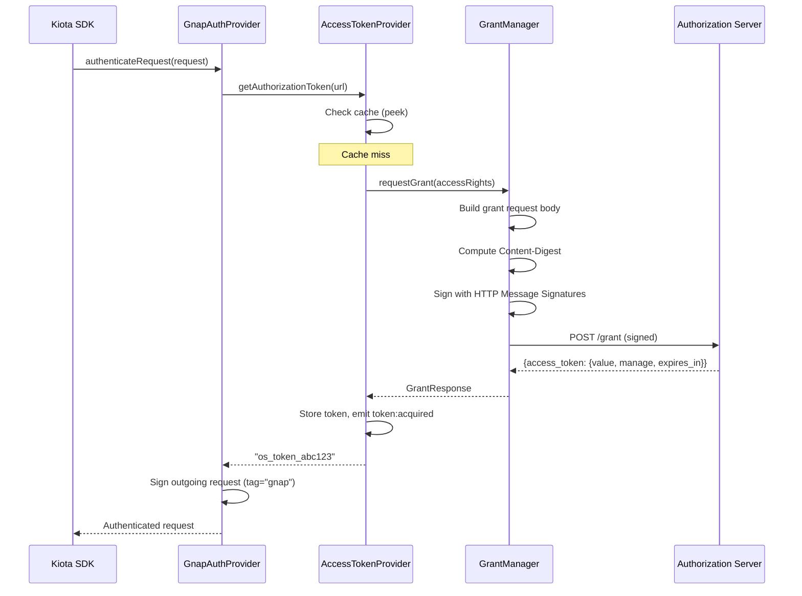
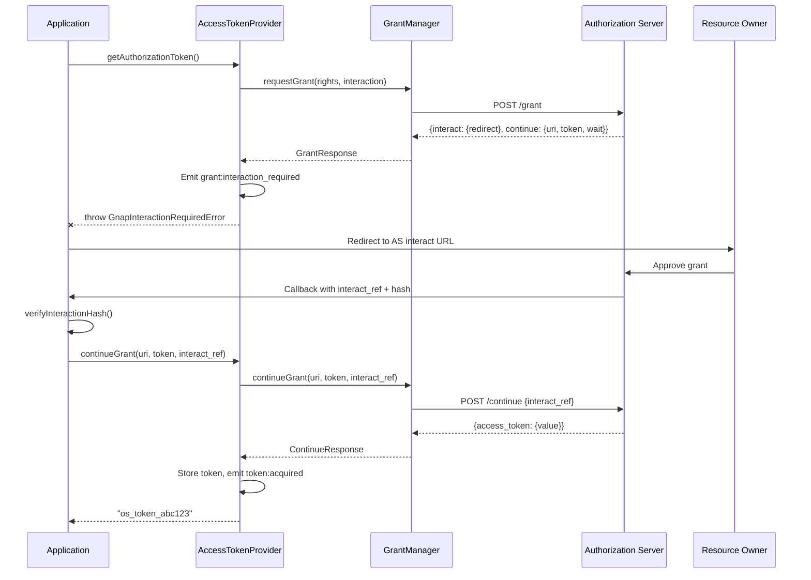
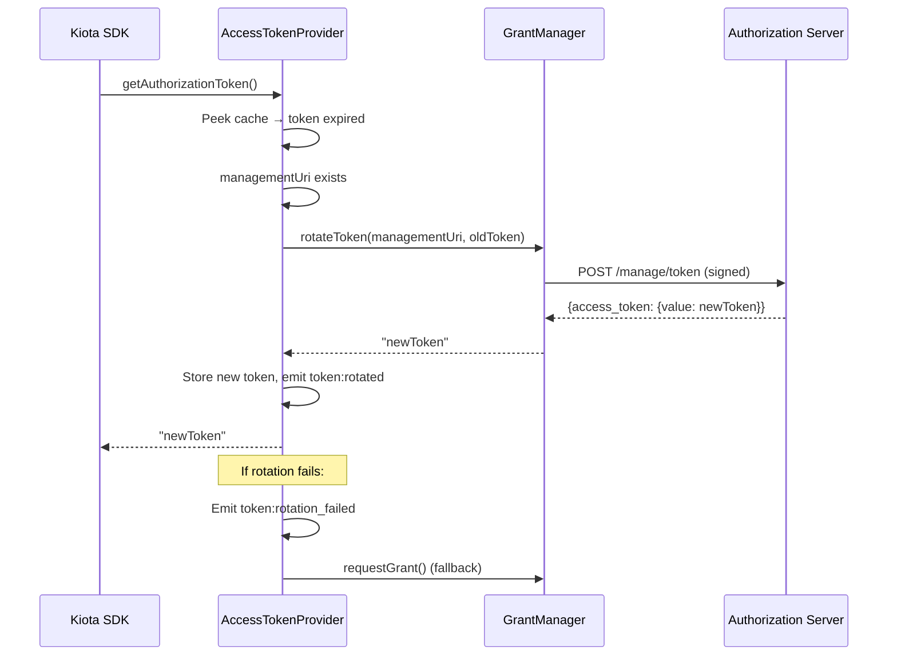

# Kiota GNAP Authentication Provider for TypeScript

> A Kiota-compatible authentication provider implementing GNAP (RFC 9635) for automated Open Payments SDK generation in TypeScript/Node.js.
>
> Built by [ShujaaPay](https://www.shujaapay.me) — contributing to the Open Payments ecosystem.

[](LICENSE)
[](https://www.rfc-editor.org/rfc/rfc9635)
[](https://learn.microsoft.com/en-us/openapi/kiota/)
[](https://www.typescriptlang.org/)
[](https://nodejs.org/)

---

## Overview

This package implements a [Kiota](https://learn.microsoft.com/en-us/openapi/kiota/) `AuthenticationProvider` that handles the complete GNAP authorization lifecycle for Open Payments APIs. When used with Kiota-generated SDKs, it enables **zero-configuration authentication** — developers get working GNAP auth out of the box.

## Features

- **Full GNAP lifecycle** — Grant requests, token acquisition, continuation, rotation, revocation, and grant deletion
- **Kiota-native** — Implements `AuthenticationProvider` interface with `AllowedHostsValidator`
- **HTTP Message Signatures** — Automatic RFC 9421 request signing via `@shujaapay/http-message-signatures`
- **Structured error handling** — Typed `GnapError` with RFC 9635 §3.6 error codes (`invalid_client`, `user_denied`, `too_fast`)
- **Token management** — In-memory token store with automatic refresh, proactive renewal, and concurrent acquisition guard
- **Continuation polling** — `pollContinuation()` with `wait` interval support and `too_fast` backoff
- **Retry with backoff** — Configurable exponential retry for transient failures (429, 5xx)
- **Lifecycle events** — Typed event emitter for `token:acquired`, `token:rotated`, `grant:error`, etc.
- **Key proof support** — Ed25519 key proofs with real JWK export for GNAP grant requests
- **Token flags** — Support for `bearer` and `durable` flags (RFC 9635 §2.1.1)
- **Content-Digest** — Automatic SHA-256 body digest header for request integrity (RFC 9530)
- **Interaction hash** — RFC 9635 §4.2.3 verification with timing-safe comparison
- **Open Payments optimized** — Wallet address identification, client display, datatypes in access rights

## Installation

```bash
npm install @shujaapay/kiota-gnap-auth-ts @shujaapay/http-message-signatures
```

## Quick Start

```typescript
import { GnapAuthenticationProvider } from '@shujaapay/kiota-gnap-auth-ts';

// 1. Create the GNAP auth provider
const authProvider = new GnapAuthenticationProvider({
  grantEndpoint: 'https://auth.wallet.example/',
  clientKey: {
    keyId: 'my-client-key',
    privateKey: myEd25519PrivateKey,
    algorithm: 'ed25519',
    proof: 'httpsig',
  },
  accessRights: [
    { type: 'incoming-payment', actions: ['create', 'read', 'list'] },
    { type: 'outgoing-payment', actions: ['create', 'read', 'list'] },
    { type: 'quote', actions: ['create', 'read'] },
  ],
});

// 2. Use with Kiota-generated client
import { OpenPaymentsClient } from './generated/openPaymentsClient';
import { FetchRequestAdapter } from '@microsoft/kiota-http-fetchlibrary';

const adapter = new FetchRequestAdapter(authProvider);
const client = new OpenPaymentsClient(adapter);

// 3. Make authenticated API calls — GNAP auth is automatic
const payments = await client.incomingPayments.get();
```

## Architecture

```
                    Kiota SDK
                       |
                       v
        +-----------------------------+
        | GnapAuthenticationProvider   |
        |  - authenticateRequest()     |
        |  - signs with tag="gnap"     |
        +-----------------------------+
                       |
          +------------+------------+
          |                         |
          v                         v
  +--------------------+   +--------------------+
  | GnapAccessToken    |   | HTTP Message       |
  | Provider           |   | Signatures         |
  |  - cache-first     |   |  - RFC 9421        |
  |  - auto-refresh    |   |  - tag="gnap"      |
  |  - proactive renew |   +--------------------+
  +--------------------+        (from @shujaapay/
          |               http-message-signatures)
          v
  +--------------------+
  | GnapGrantManager   |
  |  - requestGrant    |
  |  - continueGrant   |
  |  - rotateToken     |
  |  - revokeToken     |
  |  - JWK export      |
  +--------------------+
          |
          v
  +--------------------+
  | InMemoryTokenStore |
  |  - TTL-aware get   |
  |  - auto-prune      |
  |  - peek for rotate |
  +--------------------+
```

### Grant Flow: Non-Interactive (Immediate Token)



### Grant Flow: Interactive (Redirect → Callback → Continue)



### Token Rotation Lifecycle



[ShujaaPay](https://www.shujaapay.me) uses this provider to power authenticated Open Payments interactions across our multi-currency fintech platform:

**🔐 SDK-First Architecture** — ShujaaPay's gateway uses Kiota-generated SDKs with this auth provider, eliminating manual GNAP implementation and ensuring every API call is cryptographically signed.

**💸 Cross-Wallet Payments** — When initiating outgoing payments to Rafiki-based wallets, the provider automatically handles grant negotiation, token acquisition, and HTTP signature generation — developers write `client.outgoingPayments.create(...)` and auth is handled transparently.

**🔄 Token Lifecycle** — The provider's 30-second grace period proactive refresh ensures uninterrupted payment streams for Web Monetization, preventing mid-session token expiration during streaming micropayments.

> This provider exists because building GNAP auth from scratch requires understanding 160+ pages of RFCs. We built it once, tested it against real Open Payments infrastructure, and now any fintech can use it out of the box.

## API Reference

### `GnapAuthenticationProvider`

Main entry point implementing Kiota's `AuthenticationProvider` interface.

```typescript
const provider = new GnapAuthenticationProvider(options: GnapAuthOptions);
```

#### Options

| Parameter | Type | Required | Description |
|---|---|---|---|
| `grantEndpoint` | `string` | Yes | GNAP authorization server URL |
| `clientKey` | `ClientKeyConfig` | Yes | Client key for GNAP proofs |
| `accessRights` | `AccessRight[]` | Yes | Resources to request access to |
| `interaction` | `InteractionConfig` | No | Interaction mode (redirect/user_code) |
| `tokenStore` | `TokenStore` | No | Custom token storage (default: in-memory) |

### `GnapGrantManager`

Manages the GNAP grant lifecycle with automatic HTTP Message Signatures.

```typescript
const manager = new GnapGrantManager(grantEndpoint, clientKey);

// Request a new grant
const grant = await manager.requestGrant(accessRights, interaction);

// Continue a pending grant
const continued = await manager.continueGrant(continueUri, continueToken, interactRef);

// Rotate an access token
const newToken = await manager.rotateToken(tokenManagementUri, token);

// Revoke an access token
await manager.revokeToken(tokenManagementUri, token);
```

### `GnapAccessTokenProvider`

Orchestrates the token lifecycle with cache-first strategy.

```typescript
const provider = new GnapAccessTokenProvider(grantManager, tokenStore, accessRights);

// Get a token (from cache, rotation, or new grant)
const token = await provider.getAuthorizationToken(url);

// Continue after user interaction
const token = await provider.continueGrant(continueUri, continueToken, interactRef);
```

### `InMemoryTokenStore`

Default token storage with TTL-aware retrieval.

```typescript
const store = new InMemoryTokenStore();
await store.set('scope', tokenInfo);
const token = await store.get('scope'); // Returns undefined if expired
await store.clear(); // Logout cleanup
```

## Project Structure

```
src/
  index.ts                        # Public exports
  gnap-auth-provider.ts           # Kiota AuthenticationProvider + AllowedHosts
  gnap-access-token-provider.ts   # Token lifecycle with concurrency guard + polling
  gnap-grant-manager.ts           # GNAP grant lifecycle (RFC 9635 §2-6)
  token-store.ts                  # In-memory token storage with TTL
  errors.ts                       # GnapError, GnapInteractionRequiredError (§3.6)
  retry.ts                        # Exponential backoff retry policy
  events.ts                       # Typed event emitter for lifecycle events
  interaction-hash.ts             # Interaction hash verification (§4.2.3)
  types.ts                        # TypeScript interfaces
tests/
  token-store.test.ts             # 10 tests: CRUD, TTL, auto-prune
  gnap-grant-manager.test.ts      # 14 tests: grant/continue/rotate/revoke/delete/errors
  gnap-access-token-provider.test.ts  # 14 tests: cache, rotation, concurrency, events
  interaction-hash.test.ts        # 8 tests: SHA-256/512, tamper, injection
  errors.test.ts                  # 13 tests: error types, parsing, recovery
  retry.test.ts                   # 7 tests: retry, backoff, exhaustion
```

## Related Projects

This library is part of the **ShujaaPay GNAP Stack** by [ShujaaPay](https://www.shujaapay.me), contributing open-source tooling to the [Open Payments](https://openpayments.dev) ecosystem:

| Repo | Description | Status |
|------|-------------|--------|
| [`gnap-openapi-security-scheme`](https://github.com/REN-100/gnap-openapi-security-scheme) | `x-gnap` OpenAPI extension for GNAP security | In progress |
| **`kiota-gnap-auth-ts`** | **This repo** — Kiota GNAP auth provider | In progress |
| [`kiota-gnap-auth-python`](https://github.com/REN-100/kiota-gnap-auth-python) | Kiota GNAP auth provider (Python) | In progress |
| [`http-message-signatures-ts`](https://github.com/REN-100/http-message-signatures-ts) | RFC 9421 signing library (dependency) | In progress |

## Contributing

Contributions are welcome! Key areas:

- Integration tests with [Rafiki](https://github.com/interledger/rafiki) testnet
- Persistent token stores (Redis, SQLite)
- ECDSA-P256 key proof support
- Interaction handler utilities (redirect, user_code)

## References

- [RFC 9635 — GNAP](https://www.rfc-editor.org/rfc/rfc9635)
- [RFC 9421 — HTTP Message Signatures](https://www.rfc-editor.org/rfc/rfc9421)
- [Open Payments Specification](https://openpayments.dev)
- [Microsoft Kiota](https://learn.microsoft.com/en-us/openapi/kiota/)
- [Interledger Foundation](https://interledger.org)

## License

MIT — see [LICENSE](LICENSE) for details.

---

<p align="center">
  Made with ❤️ by <a href="https://www.shujaapay.me">ShujaaPay</a> · Contributing to Open Payments
</p>
